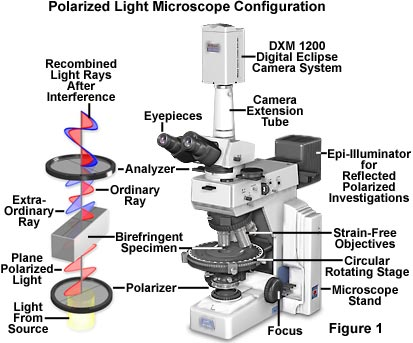
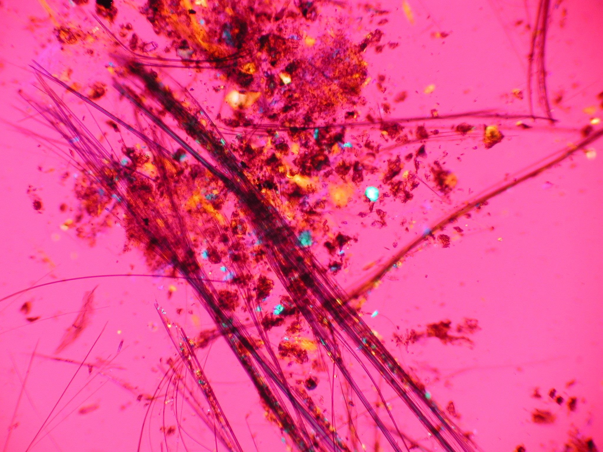

### Hi! 👋

I'm Chris, a Machine Learning enthusiast currently seeking to change careers into Machine Learning / Data Science.

I have a BS in Physics, but most of my career has been in the commercial lab testing industry, analyzing asbestos and mold samples with polarized light microscopy and electron microscopy. 

I started back in the day when most of these kind of labs didn't really use computers that much, and I became heavily involved in setting up data management systems for these labs. 

I even became an independent software developer at one point, designing and selling a LIMS (Laboratory Information Management System) for these labs. 

I've pretty much done everything in the industry - set up a lab from scratch and take it through an onsite audit and accreditation, set up and manage quality systems, train people, manage people, fire people, etc...

##### Machine Learning

And then I discovered Machine Learning and Data Science. I was amazed at how much learning material was online. It looked awesome, and it looked like a great match with my background - a bit of coding, databases, math, statistics, and science. I was being called, and I had to answer.

Over the past year and a half or so, I have been engrossed in learning as much as I can about Machine Learning and Data Science, watching  all kinds of videos and reading many articles on the subject. I liked the Kaggle classes, and I *really* liked the Kaggle competitions, in particular the Tabular Playground Series. Eventually, I had to pull myself away from this and start working on a project for my portfolio, which is what you see in the repository below. It was really fun, and I learned a lot.

My resume is also below if anybody has any leads on a job or tips they could share. I'm primarily looking for a remote job.

I'm really good at diving in and figuring things out and making it all work. I've never been, though, much of a memorizer of syntax and specific details that can be easily found online, so I do have some trepidation about the interview process. I'm hoping that my project and life experience will be enough to get me in the door somewhere.

### About Me

Married, 2 daughters, 2 dogs, 2 cats.

Hobbies: reading, travel, an occasional game of Overwatch, chauffeur for my kids. Tried writing fiction - self-published a couple of novels (one bad, one mediocre), but I eventually realized that I don't write fast enough to make money at it (even well established middle-tier authors often make less than $15K-$25K per novel.)

Interests: Science, Technology, Science Fiction, Fantasy, Transhumanism, making money, etc... (classic nerd stuff)

I have always been a computer enthusiast, starting in high school on a Vic-20 computer with 5K of RAM. I have programmed in many languages over the years, including BASIC, Pascal, DBase IV, C, C++, Visual Basic, Visual Basic for Applications (VBA), and most recently Python. I had originally planned to be a Computer Science major, but I got lured away by Physics in high school (unfortunately, I found out later that most physics majors end up working in IT anyway, so I should have just stuck with CS.)

